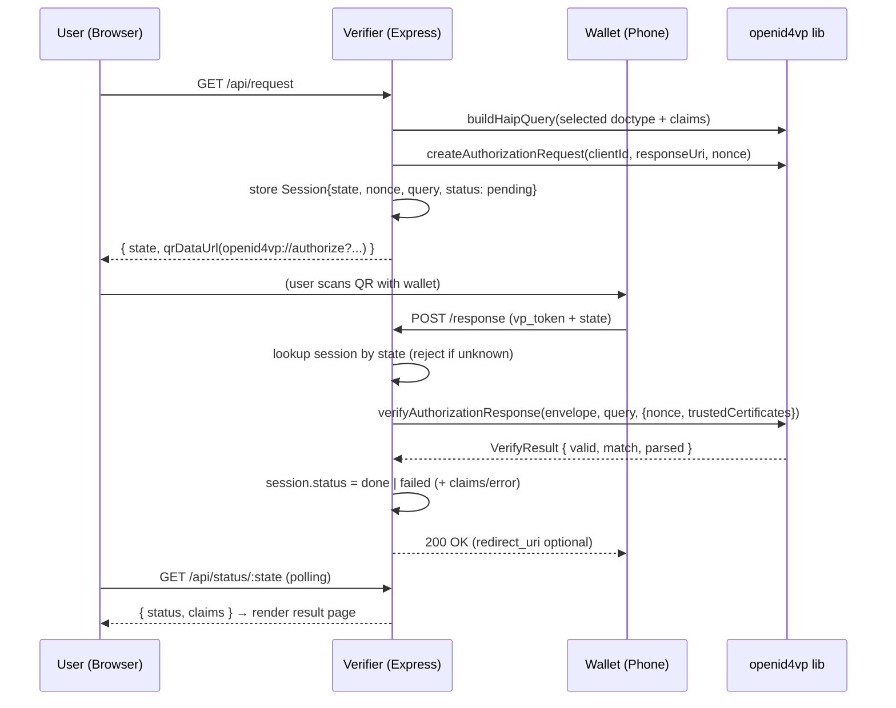

# Architecture — Minimal OpenID4VP mDOC Verifier PoC

## 1. Overview

A minimal verifier web application that requests one selected mDOC from an
EUDI-compatible wallet via OpenID4VP 1.0, validates the returned Verifiable
Presentation, and displays the disclosed claims. The supported choices are
mDL and Kiwa Sample Certificate.

The application is a thin orchestration layer over the
`@openeudi/openid4vp` library in this repository — **no library code is
modified**. All OpenID4VP, DCQL, CBOR, COSE, and session-transcript logic is
delegated to the library.

## 2. Technology stack

| Layer | Choice | Rationale |
| --- | --- | --- |
| Runtime | Node.js 20+ (ESM) | Library targets Node/browser agnostically; ESM matches the library's `"type": "module"` |
| HTTP server | Express.js 4 | Requirement; minimal, well-known |
| Frontend | Static HTML + vanilla JS | Requirement ("simple"); no build step |
| QR code | `qrcode` npm package (server-side, rendered as data-URL PNG) | Keeps the frontend dependency-free |
| Verification | `@openeudi/openid4vp` (this repo, built via `npm run build`) | Provides all protocol + crypto logic |
| Session store | In-memory `Map` with TTL | PoC only; stateless library requires caller-side state |
| Keys | Ephemeral EC P-256 keys via `jose` (already a library dependency) | No key management infrastructure needed |

## 3. Component diagram

```
┌──────────────────────────────────────────────────────────────────┐
│                         Browser (user)                           │
│   GET /            GET /api/request          poll GET /api/status │
└──────┬───────────────────┬───────────────────────────▲──────────┘
       │ HTML page         │ QR (openid4vp:// URI)      │ JSON status
       ▼                   ▼                            │
┌──────────────────────────────────────────────────────────────────┐
│                     Express server (verifier)                    │
│                                                                  │
│  routes/                                                         │
│   ├─ pageRoutes.js     GET /                  → static HTML      │
│   ├─ requestRoutes.js  GET /api/request       → create session,  │
│   │                                             build auth req,  │
│   │                                             return QR PNG     │
│   ├─ responseRoutes.js POST /response         → wallet callback, │
│   │                                             validate VP       │
│   └─ statusRoutes.js   GET /api/status/:state → poll result      │
│                                                                  │
│  services/                                                       │
│   ├─ sessionStore.js   Map<state, Session>, TTL, one-shot        │
│   ├─ queryBuilder.js   buildHaipQuery (mso_mdoc / selected type) │
│   ├─ requestService.js createAuthorizationRequest                │
│   └─ verifyService.js  verifyAuthorizationResponse               │
│                                                                  │
│  config.js             hostname, port, trusted certs, TTLs       │
└──────────────────────────────┬───────────────────────────────────┘
                               │ import
                               ▼
┌──────────────────────────────────────────────────────────────────┐
│              @openeudi/openid4vp library (this repo)             │
│  authorization.ts · haip.ts · verify.ts · decrypt-response.ts    │
│  parsers/mdoc.parser.ts · crypto/* · trust/*                     │
└──────────────────────────────────────────────────────────────────┘
                               ▲
                               │ POST /response (direct_post)
┌──────────────────────────────┴───────────────────────────────────┐
│                     EUDI Wallet (holder device)                  │
│              scans QR → consent → presents selected mDOC         │
└──────────────────────────────────────────────────────────────────┘
```

## 4. Flow (cross-device, QR-based)



## 5. Endpoints

| Method | Path | Purpose | Notes |
| --- | --- | --- | --- |
| GET | `/` | Serve `public/index.html` | "Verify my mDL" button |
| GET | `/api/request` | Create session, return `{ state, qr, uri, doctype, label }` | Optional `?doctype=...`; defaults to mDL |
| POST | `/response` | Wallet `direct_post` callback | `application/x-www-form-urlencoded`; fields `vp_token`, `state`, (or `response` JWE in the encrypted variant) |
| GET | `/api/status/:state` | Poll verification result | `{ status: 'pending' \| 'done' \| 'failed', claims?, error? }` |

The browser polls `/api/status/:state` because the wallet posts directly to
the server — the browser page never sees the response.

## 6. Session model

```ts
type SessionStatus = 'pending' | 'done' | 'failed' | 'expired';

interface Session {
  state: string;            // UUID, key of the map
  nonce: string;            // UUID, replay protection / device binding
  clientId: string;
  responseUri: string;
   doctype: string;            // exactly one selected mDOC doctype
  query: DcqlQuery;         // the exact query sent to the wallet
  createdAt: number;
  expiresAt: number;        // createdAt + 5 min
  status: SessionStatus;
  result?: VerifyResult;    // on success
  error?: string;           // on failure
}
```

Rules:
- One-shot: once `done`/`failed`, the session cannot be replayed.
- TTL: 5 minutes; a sweeper (or lazy check on read) removes expired entries.
- In-memory only — restart wipes sessions (acceptable for PoC).

## 7. Library integration points

| Verifier concern | Library call | Module |
| --- | --- | --- |
| DCQL query for selected mDOC | `buildHaipQuery({ credentialId, format: 'mso_mdoc', doctypeValue, claims })` | `src/haip.ts` + `poc-verifier/src/doctype-config.js` |
| Authorization request | `createAuthorizationRequest({ clientId, responseUri, nonce }, query)` → `{ uri, state, dcqlQuery }` | `src/authorization.ts` |
| Response validation | `verifyAuthorizationResponse({ vp_token }, query, { nonce, trustedCertificates })` | `src/verify.ts` |
| Issuer trust (PoC) | `trustedCertificates: [issuerCertDerBytes]` option | `src/parsers/*` |
| Issuer trust (later) | `StaticTrustStore` / `LotlTrustStore` | `src/trust/` |

## 8. Deployment view (PoC)

Single Node process:

- `npm run build` in the library repo → `dist/`
- PoC app imports the library (file dependency or npm workspace)
- Runs on `https://<host>` — a public HTTPS URL is **mandatory** for a real
  wallet to reach `/response`; for local development use a tunnel
  (ngrok / cloudflared) or the `docker/oidf-conformance-suite` nginx setup as
  a reference for TLS termination.

## 9. Non-goals

- Multi-credential presentations (library rejects them:
  `MultipleCredentialsNotSupportedError`).
- Signed requests (JAR) and encrypted responses (`direct_post.jwt`) — the
  library supports both via `createSignedAuthorizationRequest` /
  `decryptAuthorizationResponse`; documented as an upgrade path only.
- Persistent storage, user accounts, production-grade key management.
- SD-JWT VC credentials (supported by the library, out of PoC scope).
- Proximity (BLE/NFC) flows.

## 10. Key architectural decisions

1. **Library-first**: all protocol logic stays in `@openeudi/openid4vp`; the
   app only does HTTP, sessions, QR, and rendering. This keeps the PoC small
   (~300 lines of app code) and automatically benefits from library fixes.
2. **Polling status endpoint** instead of WebSockets/SSE — simplest mechanism
   that works for the browser-side flow.
3. **Server-side QR generation** as a PNG data URL — zero frontend
   dependencies.
4. **In-memory sessions with TTL and one-shot semantics** — satisfies the
   replay-protection requirements of OpenID4VP without infrastructure.
5. **Unsigned request + `direct_post` first** — smallest working slice;
   JAR/encryption is a documented follow-up because it requires verifier
   certificates and public key hosting.
