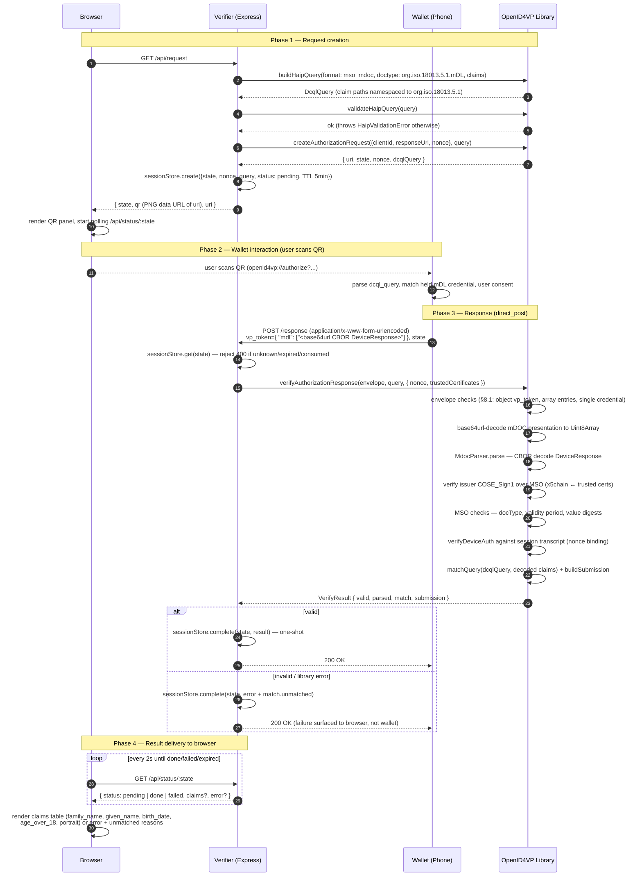
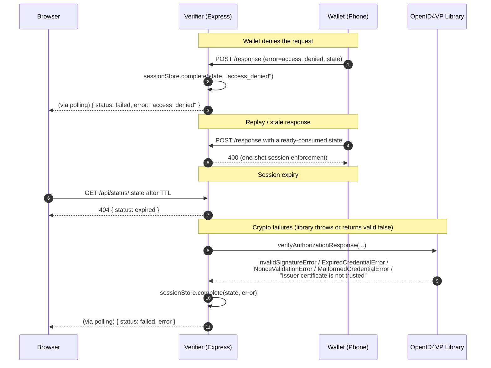

# OpenID4VP mDL Verification — Sequence

Complete cross-device flow for the PoC verifier: browser-driven request, QR
handoff to the wallet, `direct_post` response, and validation delegated to the
`@openeudi/openid4vp` library.

Participants:

- **Browser** — the user's desktop browser showing the verifier UI
- **Verifier** — the Express application (HTTP, sessions, QR)
- **Wallet** — the EUDI-compatible wallet on the user's phone holding the mDL
- **Library** — `@openeudi/openid4vp` (this repository)

## Full flow

## Failure and edge paths

## Notes

1. **Stateless library, stateful verifier.** The library never tracks `state`
   or `nonce`; the verifier's session store binds them, enforces the one-shot
   rule, and the caller compares `state` before invoking the library.
2. **Nonce binding.** The `nonce` from the authorization request flows into
   the mDOC session transcript, so the wallet's device signature is bound to
   this exact session — replayed responses fail device-auth.
3. **Encrypted variant (`direct_post.jwt`).** Not in the PoC baseline: the
   wallet posts `{ response: "<JWE>" }` instead; the library decrypts it
   (`decryptAuthorizationResponse`, ECDH-ES + A128/256GCM) and auto-builds the
   mDOC session transcript from the JWE `apu` header (ISO 18013-7) or the
   verifier encryption JWK thumbprint (OpenID4VP 1.0). See
   VERIFIER_CAPABILITIES.md §3.
4. **Polling vs push.** The browser learns the outcome by polling
   `/api/status/:state` because the wallet talks directly to the verifier
   backend; WebSockets/SSE were rejected for PoC simplicity.
